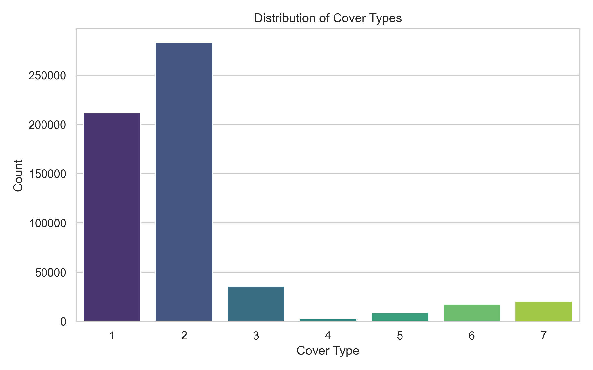
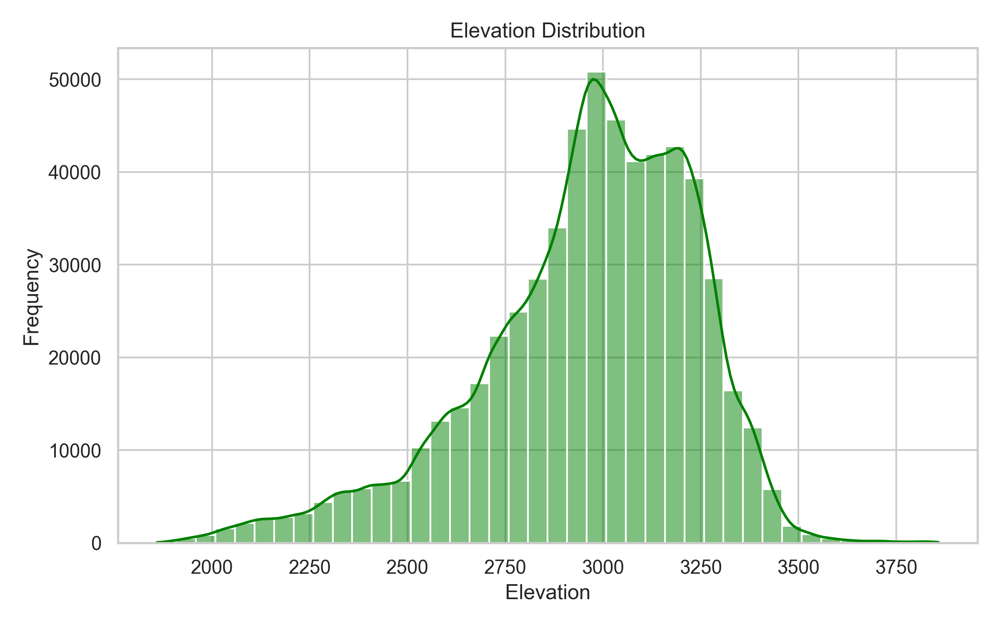
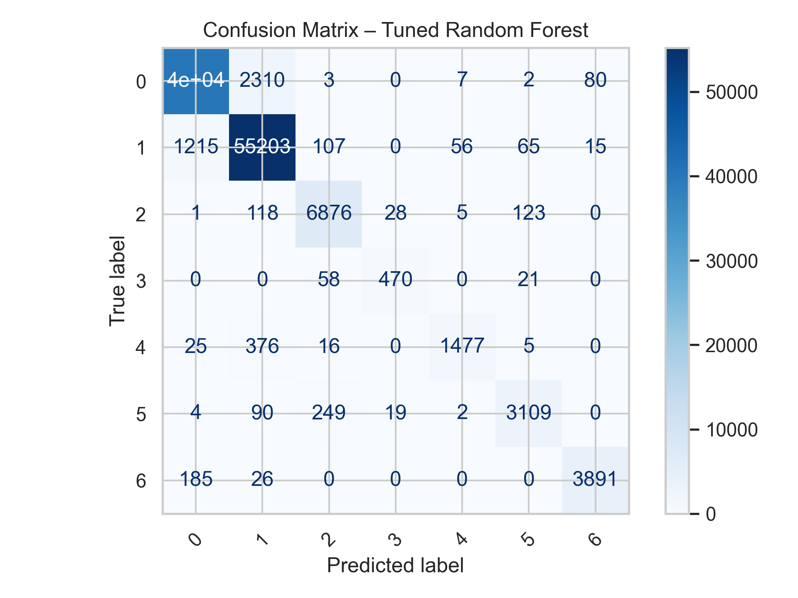

---

# 🌲 Forest Cover Type Prediction (Multiclass Classification)

Predicting forest cover type based on environmental and geographical features using **Machine Learning** and **Deep Learning** techniques.
This project applies multiple models, compares their performance, and identifies the best approach for structured ecological tabular data.

---

## **Project Overview**

Forests are influenced by elevation, soil composition, hydrology, sunlight, and terrain characteristics.
This project uses the **UCI Forest CoverType dataset** to classify land areas into one of **7 forest cover types**.

The aim is to:

* Understand environmental feature interactions
* Train various ML models
* Tune selected models
* Compare performance using a consistent evaluation pipeline
* Identify the best algorithm for ecological prediction tasks

---

## **Dataset Information**

**Source:** UCI Machine Learning Repository
**Samples:** 581,012
**Features:** 54

* **10 continuous geographical features**
* **44 one-hot encoded categorical features** (soil type & wilderness area)

**Target Variable:** `Cover_Type` (1–7)
Represents tree species such as Spruce/Fir, Aspen, Douglas-fir, etc.

---

## **Preprocessing Steps**

* Exploratory Data Analysis (EDA)
* Created engineered feature: **Hydro_Euclidean distance**
* Standardization applied only to models that required it (KNN, SVM, MLP)
* Train/test split: **80/20**, stratified
* No missing values in dataset

---

## **Exploratory Data Analysis (EDA)**

Key plots generated:

* Cover type distribution
* Elevation histogram
* Elevation vs. Cover Type boxplot
* Correlation heatmap for geographical features

These visualizations helped understand data shape, class balance, and relationships.

---

## **Models Implemented**

### **Baseline Models**

* Logistic Regression
* Linear SVM
* K-Nearest Neighbors (KNN)
* Decision Tree
* Random Forest
* HistGradientBoosting
* Neural Network (MLP)

### **Tuned Models**

* Random Forest (RandomizedSearchCV)
* Neural Network (optimized architecture)
* HistGradientBoosting (learning rate tuning)

---

## **Results Summary**

| Model                        | Accuracy   |
| ---------------------------- | ---------- |
| **Random Forest (tuned)**    | **95.52%** |
| Random Forest (baseline)     | 95.47%     |
| Decision Tree                | 93.84%     |
| Neural Network (tuned)       | 93.75%     |
| Neural Network (baseline)    | 87.16%     |
| KNN                          | 86.48%     |
| HistGradientBoosting (tuned) | 87.13%     |
| Logistic Regression          | 71.92%     |
| Linear SVM                   | 71.14%     |

**Best Model:**
 **Random Forest (tuned)** – highest accuracy, stable behavior, and interpretable feature relationships.

---

## **Why Random Forest Performed Best**

* Handles **non-linear feature interactions**
* Works well with **mixed numerical + categorical (one-hot) features**
* Reduces overfitting using ensembling
* Excels in high-dimensional tabular datasets

Neural Networks performed very well after tuning but required more compute and careful hyperparameter control.

---

## **Important Visualizations**


*Distribution of Forest Cover Types*


*Elevation Histogram*


*Correlation Heatmap of Continuous Features*


*Model Accuracy Comparison*


*Confusion Matrix — Tuned Random Forest*

---

## **Project Structure**

```
│── data/
│   └── covtype.csv
│
│── notebooks/
│   └── forest_cover_prediction.ipynb
│
│── images/
│   ├── target_distribution.png
│   ├── elevation_histogram.png
│   ├── elevation_vs_cover_type.png
│   ├── correlation_heatmap.png
│   ├── model_accuracy_comparison.png
│   ├── rf_confusion_matrix.png
│   ├── mlp_confusion_matrix.png
│   └── dt_confusion_matrix.png
│
│── src/
│   ├── preprocess.py
│   ├── models.py
│   ├── evaluation.py
│
│── README.md
│── requirements.txt
│── report.pdf
```

---

## **How to Run the Project**

### **1. Clone the repository**

```bash
git https://github.com/affan810/AIT511_Part-2.git
cd AIT511_Part-2
```

### **2. Install dependencies**

```bash
pip install -r requirements.txt
```

### **3. Run the Jupyter Notebook**

```bash
jupyter notebook
```

Open:

```
main.ipynb
```

---

## 🧩 **Future Improvements**

* Add XGBoost, CatBoost, LightGBM
* Apply SMOTE or class-weight adjustments for imbalance
* Use stacking or ensemble blending
* Incorporate GPS, climate, and temporal data
* Deploy as API or web app using Flask / FastAPI
* Add SHAP analysis for explainability

---

## 📜 **Author**
* **Affan Shaikh (MT2025016)**
